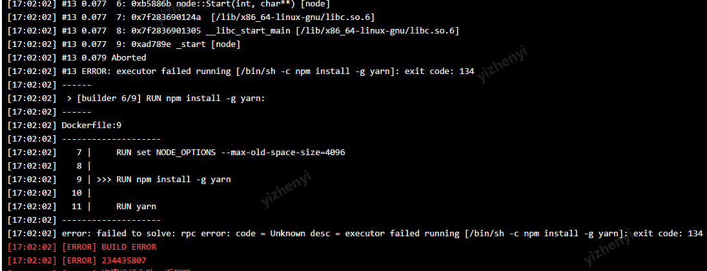

## node 部署问题

部署时选用 18.20.4 镜像报错

```
 ERRoR: executor failed running [/bin/sh -c npm install -g yarn]: exit code: 134
[17:02:027
[17:02:02]
>[builder 6/9] RuN npm install -g yarn:
17:02:027
------
[17:02:02]
Dockerfile:9
[17:02:027
[17:02:02]
>
RUN Set NODE OPTIONS
--max-old-space-size=4096
[17:02:02]
8
[17:02:02]
9
>>> RUN npm install
-g yarn
10
[17:02:02]
[17:02:021
2
RUN yarn

```



(替换其他版本也会报错)

查到 134 为内存溢出等受环境影响而退出的错误

尝试：通过设置 node-options 扩大使用内存，并没有成功

检索到如下内容：
https://stackoverflow.com/questions/59766839/error-code-elifecycle-npm-err-errno-134

转到实质 issue

https://github.com/nodejs/docker-node/issues/1254

**替换为 18.20.4-alpine 镜像成功解决**

### 初步怀疑

可能是 node 镜像打包的方式和运行构建的机器芯片兼容性问题。也许和指令集有关。

### 扩展

1、node 镜像各标签代表的意义

https://stackoverflow.com/questions/52083380/in-docker-image-names-what-is-the-difference-between-alpine-jessie-stretch-an
