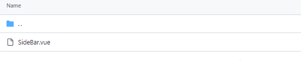
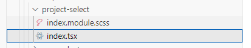
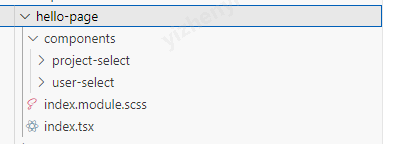
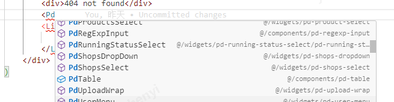
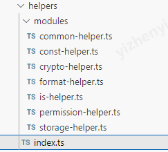
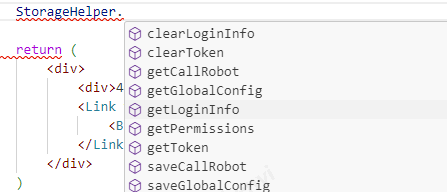

## 前言

关于编程习惯，或者一些编程范式。每个人的选择可能都各有不同。每次换工作之后可能都会有一些见解不一样的地方，因此也在此记录一下自己平常编程的一些习惯。

## 命名风格

对于命名风格，我的选择还算比较大众。

### 变量

```

普通变量、函数: 小驼峰命名 (camelCase)

组件:大驼峰 (PascalCase)

常量: 全大写 下划线分割 (UPPER_CASE)

```

### 文件

对于 Vue，如果这是个组件文件我会选择和组件一样的大驼峰命名。所见即所得，而且对于组件来说这个文件本身就已经包含 css、html、js 了(vue 的单文件组件)。



而对于 React，如果是组件的话，我会采用短线分割(kebab-case-example)的方式去命名这个文件夹，并在其下创建 index 文件来导出它。因为其下大概率还会包含它的 css 文件。



对于 Vue 项目和 React 项目的页面，我选择将他们包含在他文件夹下, 并以 components 文件夹去管理此模块或者页面下的一些组件。



## 组件和公共方法管理

### 组件

对于全局组件我会将组件分为两类：公共组件和公共业务组件。分别放在两个不同的文件夹下。

公共组件(components)：

公共组件简单来讲就是公共样式组件，这些组件不包含任何业务逻辑。把这个组件转移到其他项目依然可以正常使用。一般都是封装了一些 UI 特殊要求的组件，而和项目里用的组件样式不一致的地方。

公共业务组件(widgets):

公共业务组件即封装了和当前项目业务强相关的一些逻辑，在项目中多处需要用到的组件。比如用户选择 Select、项目选择 Select 等。最简单的判断方式就是这个组件中是否包含了接口请求，包含接口请求，那必然是公共业务组件了。

在命名上：

我会选择 [前缀] + [业务/逻辑/样式] + [组件类型]的方式

对于组件的管理上的分歧，其实很多时候都在于要封装到什么样的程度才算好这个问题。在我看来最重要的判断在于，我怎么样才能最大程度的方便以后的开发。按是否和业务相关划分可以很大的减少开发查找的思维消耗。而添加前缀和组件类型在命名中，开发只要在编辑器中键入前缀即可看到编辑器给的提示。如果没有前缀，开发就需要先确定你要的组件叫什。



### 公共方法

公共方法的管理，以帮助类为例子。我会在文件夹下的 index.ts 文件中通过 export \* as XXX 的方式把各个模块按模块名导出。



```
export * as ConstHelper from './modules/const-helper';
export * as IsHelper from './modules/is-helper';
export * as FormatHelper from './modules/format-helper';
export * as StorageHelper from './modules/storage-helper';
export * as CommonHelper from './modules/common-helper';
export * as PermissionHelper from './modules/permission-helper';
export * as CryptoHelper from './modules/crypto-helper';
```

这种处理方式其实有一些争议，因为这样导出的方式会导致 webpack 的 tree shack(摇树)失效，是一种负优化。但是在我看来这种处理方式可以最大程度的方便开发能够快速的找到自己需要的公共方法，损失的加载速度大多数时候来看我认为是值得的。

比如我想要存储一个键值对，我只要键入 StorageHelper.编辑器就会提示我这个对象下有哪些方法。



## 全局数据

我的意见是，非必要不要用全局数据。如果这个数据确实是全局的，那么你必须要有一个专门管理它的对象或者方法。绝对不能直接在你的页面或者组件中直接去写。

## 未完待续
