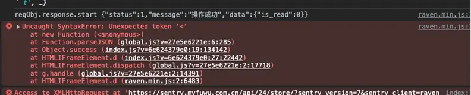
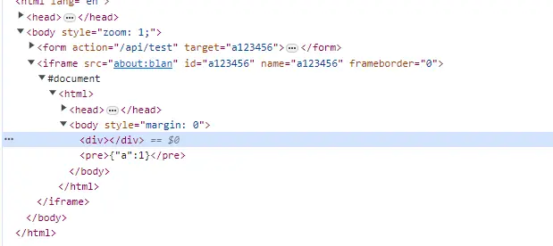
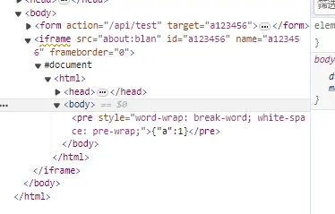
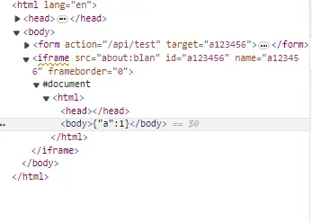
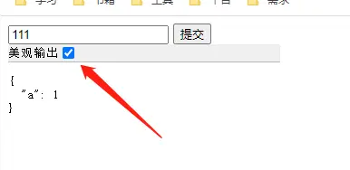

## 解析错误
线上发版一个旧项目后发现在导入文件时，出现json解析错误。


## 排查过程

当前情况：

```
1、在我自己电脑上无法相同操作无法复现。
2、接口返回是完全正常的json，并不存在 < 号。
```

经过排查发现此处发起请求的方式是通过form表单的target属性去指定iframe，将action请求结果填充在iframe里，再去读取iframe里的body。
(ps: 好古老的请求方式)

那么很明显，解析到的<号明显是html的标签混进来了。debug后证实了我这个猜想。

## 为什么我本地无法复现

版本问题

一开始其实怀疑过是不是因为升级了117版本，禁用了第三方cookie导致的。但是接口完全正常所以就没有问题。通过对比不同浏览器时，发现在117版本，相比其他版本和其他浏览器，form表单提交后填充到iframe中会多一个div标签，同时填充的pre标签没有了style。





因此我本地依然是116版本的Chrome浏览器所以无法复现这个问题。升级了浏览器后成功复现，验证了这个说法。

## 原理分析

首先不得不吐槽这种请求方式太奇葩了。但是作为前端工程师确实需要多关注主要浏览器升级的消息，否则也不会这么快的定位到是版本原因。

另一个细节是：
```
接口返回(contentType: application/json):
返回的body会用标签包裹起来再放到iframe当中(这也很正常，因为对于浏览器你发送的是格式化的数据)。

接口返回(contentType: text/html):
返回的body会直接放置在body标签中。
```



而这一次直接多出来了div标签则是，Chrome提供出来的美化你输出的json的按钮。



## 总结

1. 首先不应该使用这种请求的方式，有更适合的方式(ps: 这段代码可能已经非常久远了)
2. 多关注浏览器和规范相关的更新内容。


